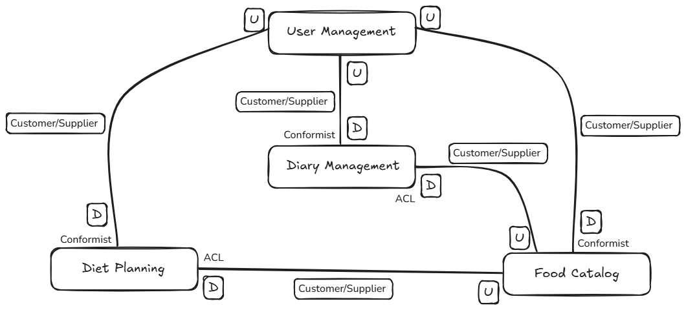

# Food Diary Architecture

- [Food Diary Architecture](#food-diary-architecture)
  - [Descrizione](#descrizione)
  - [Specifiche del progetto](#specifiche-del-progetto)
  - [Strategic DDD](#strategic-ddd)
    - [Ubiquitous Language](#ubiquitous-language)
    - [Subdomains e Bounded Contexts](#subdomains-e-bounded-contexts)
    - [Context Maps](#context-maps)
      - [User Management Context](#user-management-context)
      - [Food Catalog Context](#food-catalog-context)
      - [Diet Planning Context](#diet-planning-context)
      - [Diary Management Context](#diary-management-context)
      - [Shared Kernel](#shared-kernel)
  - [Tactical DDD](#tactical-ddd)
    - [User Management Context](#user-management-context-1)
    - [Food Catalog Context](#food-catalog-context-1)
    - [Diet Planning Context](#diet-planning-context-1)
    - [Diary Management Context](#diary-management-context-1)
    - [Shared Kernel](#shared-kernel-1)

## Descrizione

Questo readme ha il solo scopo di progettare su carta una applicazione applicando i principi del Domain Driven Design e altri principi descritti nella sezione Architecture. Non è necessario implementare le scelte fatte, quanto è necessario pensare alle soluzioni tecniche coinvolte.

## Specifiche del progetto

Il progetto ha lo scopo di creare una applicazione che possa gestire il diario alimentare di un utente. Lo scopo è creare quindi il backend e la business logic alla base dell'applicazione. Tramite un'altra applicazione di frontend, verrà create l'interfaccia che mette a disposizione la logica di backend all'utente finale, interfacciandosi con tutti i componenti della business logic.

Qui elenchiamo diverse funzionalità che ci aspettiamo possa fare la nostra applicazione:

- Ogni User ha un account
  - Gli User possono avere l'account type Subject / Nutritionist
    - Il Subject ha accesso solo ai suoi dati personali e può
      - modificare il suo Diary
      - selezionare/creare un Diet
      - aggiungere dei Food
    - Il Nutritionist ha accesso ai dati dei suoi pazienti che sono i Subject che hanno accettato di essere pazienti di un Nutritionist e può
      - creare una Diet per un Subject e selezionarla per lui
      - creare delle note sul Diary
      - aggiungere dei Food
- Il Food è un cibo particolare con le sue caratteristiche
  - Ha una tabella nutrizionale (calorie e macronutrienti) basata su una certa BaseQuantity
  - Ha una BaseQuantity (100g, 100ml) usata per rapportare la tabella nutrizionale
  - Ha uno User Creator che può essere Nutritionist, Subject, o nessuno. Nel caso non sia definito, si tratta di alimenti base dell'applicazione
  - Un Subject può vedere tutti gli alimenti dove il Creator non è definito o dove il Creator è lui o dove il Creator è il suo Nutritionist
  - Un Nutritionist può vedere tutti gli alimenti dove il Creator non è definito o dove il Creator è lui o dove il Creator è un suo Subject
  - Un Subject può modificare solo gli alimenti che ha creato lui stesso
  - Un Nutritionist può modificare solo gli alimenti che ha creato lui stesso o un suo Subject
- La Diet è il componente che definisce la tabella nutrizionale adatta per te
  - Il Nutritionist o il Subject possono creare una Diet che può essere di tipo Menu o SwapList
  - Il Menu Diet avrà dei ProposalMeal con dei ProposalMealRow che rappresentano dei pasti proposti che vengono applicati interamente dal Subject
  - Il Meno SwapList avrà dei ProposalMealCategory con un certo type che avranno delle ProposalMealRow. Il Subject potrà scegliere una ProposalMealRow per ogni ProposalMealCategory
  - Ogni ProposalMealRow ha la sua NutritionalTable basata su quella del food
  - La Diet avrà un NutritionalTarget che sono i valori della NutritionalTable da raggiungere per una giornata, questi verranno poi confrontati con la NutritionalTable di ogni DiaryPage
  - (AGGIUNTIVO) Avrà una funzione di calcolo di un Meal bilanciato rispetto ad una certa tabella nutrizionale: provo a comporre il mio Meal con delle MealRow che hanno certe Quantity e vedo il risultato rispetto ai limiti del Meal che dovrei fare. Utile per personalizzarsi la dieta
  - Avrà una descrizione con le linee guida da seguire
  - Esisteranno delle Diet preconfigurate senza alcun Creator e delle Diet con Nutritionist come Creator
  - Subject e Nutritionist possono vedere tutte le diete senza alcun Creator o con il Nutritionist come Creator
- Il Diary è un componente complesso che registra i pasti, le calorie e i macronutrienti assunti giorno per giorno man mano che il Subject li registra
  - Un Subject può avere più Diary (anche se di norma dovrebbe averne logicamente uno) ed uno di default
  - Il Diary può avere delle DiaryPage che rappresentano un giorno, quindi avranno una data
  - Ogni DiaryPage può avere dei Meal che rappresentano i pasti della giornata, quindi avranno un MealType (colazione, pranzo, cena, spuntino, pasto libero...)
  - I Subject possono creare un MealType, creare qui un MealType lo crea anche nel Diet
  - Ogni Meal avrà delle MealRow che rappresentano un Food e una Quantity
  - Avendo il Food e la Quantity di ogni MealRow, posso ricostruire la tabella nutrizionale (calorie e macronutrienti) dal rapporto con la BaseQuantity del Food per ogni MealRow
  - Avendo la tabella nutrizionale per ogni MealRow, posso sommarle per avere quindi la tabella nutrizionale di ogni Meal e quindi della DiaryPage
  - Se ho selezionato una Diet, posso avere degli "alert" riguardo a quanto sono vicino o lontano dagli obiettivi della proposta di tabella nutrizionale nel mio DiaryPage e per MealType
  - Se ho selezionato una Diet, posso dalla Diet aggiungere una o più ProposalMealRow (i pasti consigliati li faccio esattamente come sono e quindi li aggiungo tali e quali)
  - Il Nutritionist può scrivere commenti su DiaryPage, Meal, MealRow

## Strategic DDD

Questa pianificazione è semplicemente una bozza per mostrare cosa potrebbe essere necessario, ma non è stata implementata. Implementandola si potrebbe notare che manca qualcosa oppure è stato fatto qualcosa di troppo. Per esempio probabilmente gli Domain Event sono per la maggior parte superflui se nessun altro servizio necessita di quell'evento. Sono comunque stati messi per dare una idea delle varie possibilità implementative.

**Repositories**: ogni Bounded Context ha sostanzialmente un singolo repository che gestisce la sua Aggregate Root. È importante capire lo scopo qui dei repository rispetto ai database. Ogni Bounded Context utilizzerà un DB relazionale, visto che ogni oggetto è piuttosto strutturato. Le tabelle create, che possono essere varie, possono essere accedute tramite ORM. Lo scopo dei Repository è quello di creare una interfaccia che mappi gli oggetti a database negli oggetti di dominio (Entity / Value Object). Io potrei avere anche una singola tabella a DB che rappresenta più oggetti di dominio, ma l'implementazione del Repository che lavora via ORM (o SQL Native) dovrà prendere la singola riga generare gli oggetti di dominio che saranno quelli restituiti dai suoi metodi.

Facciamo un esempio con il Food che ha "FoodId", "BaseQuantity", "NutritionalTable", "Creator" che sono dei Value Object o Entity. Quindi l'oggetto Food avrà gli attributi relativi a questi oggetti che a loro volta avranno i loro attributi. A database la riga Food sarà una sola ma nell'applicazione sia avrà un oggetto Food e i sotto oggetti, tipo Food.NutritionalTable.Calories.

### Ubiquitous Language

Qui mettiamo la lista dei termini che diventeranno specifici del nostro progetto. Per comodità e visto che il progetto è ridotto, non saranno suddivisi per singolo Bounded Context, ma gli stessi in tutti. Per chiarezza sono gli stessi termini che sono stati utilizzati nelle [Specifiche del progetto](#specifiche-del-progetto):

- **User**: Utente generico che utilizza l'applicazione e può avere un tipo specifico (Subject/Nutritionist)
- **Subject**: Tipo di utente che utilizza il diario e inserisce i pasti
- **Nutritionist**: Tipo di utente che gestisce le diete di più utenti **Subject** e commenta i loro **Diary**
- **Food**: Alimento con tabella nutrizionale e **BaseQuantity**
- **BaseQuantity**: Quantità di riferimento per la tabella nutrizionale (es. 100g, 100ml)
- **Diet**: Piano alimentare con obiettivi nutrizionali e proposte di pasti
- **DietType**: Tipo di dieta che può essere a "Menu"/"**Menu**" o "Lista di scambio"/"**SwapList**"
- **ProposalMeal**: Un pasto proposto nella dieta che può contenere o direttamente i **ProposalMeal** con le relative **ProposalMealRow** per la **DietType** **Menu** oppure i **ProposalMeal** contengono le **ProposalMealCategory** che contengono i **ProposalMealRow**
- **ProposalMealRow**: Suggerimento di porzione per la dieta a scambio
- **ProposalMealCategory**: Raggruppa le **ProposalMealRow** per la dieta a scambio da cui il **Subject** può andarsi a prendere una riga per **ProposalMealCategory**
- **NutritionalTarget**: è un insieme dei valori della **Nutritional Table** limite per una giornata. Questi verranno poi controllati e comparati con la **Nutritional Table** della **Diary Page**
- **Diary**: Registro dei pasti consumati
- **DiaryPage**: Rappresenta i pasti di una singola giornata
- **Meal**: Pasto specifico (colazione, pranzo, cena, etc.)
- **MealType**: Categoria di pasto (colazione, pranzo, cena, spuntino, pasto libero)
- **MealRow**: Singolo elemento di un pasto (Food + Quantity)
- **NutritionalTable**: Tabella con calorie e macronutrienti che nel **Food** sono definiti come proprietà mentre negli altri contesti sono calcolati a partire dal valore sul **Food** relativo. È composta da:
  - **Calories**: espresso sempre in kcal
  - **Carbs**: espresso in g
  - **Sugars**: espresso in g
  - **Fat**: espresso in g
  - **Proteins**: espresso in g
  - **Salt**: espresso in g

### Subdomains e Bounded Contexts

Dalle specifiche si possono ricavare i seguenti subdomain e accoppiarli al relativo bounded context per semplicità:

- **Diary Management**: Core Domain
- **Food Catalog**: Core Domain
- **Diet Planning**: Core Domain
- **User Management**: Supporting Domain

### Context Maps

#### User Management Context

- Gestione degli account, autenticazione, ruoli, e relazioni Subject-Nutritionist
- Usato da:
  - Diary Management
  - Diet Planning
  - Food Catalog
- Relazione:
  - Si potrebbe usare Shared Kernel o Conformist ma creerebbe una dipendenza forte che non si vuole avere in questo progetto di esempio
  - Si può usare invece un Customer/Supplier (come Supplier/Upstream) creando una struttura dove i vari microservizi devono avere un oggetto e delle funzioni interne che rappresentano lo User per quanto gli serva

#### Food Catalog Context

- Gestione del catalogo degli alimenti e tabella nutrizionale
- Importa:
  - User Management: regole di visibilità/modifica
    - In quanto Customer/Downstream, può applicare un ACL per rimappare e validare i dati ricevuti
- Esporta:
  - Food con la NutritionalTable
- Relazioni:
  - Customer/Supplier (come Supplier/Upstream) con Diary Management e Diet Planning

#### Diet Planning Context

- Creazione diete, obiettivi nutrizionali, proposte pasti
- Importa
  - User Management: per sapere chi può creare/assegnare
    - In quanto Customer/Downstream, può applicare un ACL per rimappare e validare i dati ricevuti
  - Food Catalog: per comporre i pasti
    - In quanto Customer/Downstream, può applicare un ACL per rimappare e validare i dati ricevuti
- Esporta
  - Diete assegnate e obiettivi nutrizionali
- Relazioni
  - Customer/Supplier (come Supplier/Upstream) con Food Catalog

#### Diary Management Context

- Registrazione e tracciamento dei pasti quotidiani, calcolo NutritionalTable, commenti
- Importa
  - User Management: per sapere chi può creare/modificare
    - In quanto Customer/Downstream, può applicare un ACL per rimappare e validare i dati ricevuti
  - Food Catalog: per comporre i pasti
    - In quanto Customer/Downstream, può applicare un ACL per rimappare e validare i dati ricevuti
  - Diet Planning: per confrontare con obiettivi nutrizionali
    - In quanto Customer/Downstream, può applicare un ACL per rimappare e validare i dati ricevuti

#### Shared Kernel

Alcuni Value Object, Enum, funzioni pure, eventi condivisi, types possono essere in comune e alla base di vari microservizi. Non essendo specifici di un dominio ma condivisibili e molto stabili, si può scegliere di creare uno Shared Kernel che li raccoglie insieme.
Un esempio è il ValueObject che rappresenta un utente loggato, questo sarò uguale ovunque, oppure la logica per calcolare i valori nutrizionali di una riga del pasto dai valori base di un food che dovrà essere utilizzata sia nel Diet Planning che nel Diary Management.

Questo Shared Kernel è sostanzialmente un repository dedicato che diventerà un package publicato su un registry e importato dai microservizi. Questo creerà un legame forte tra tutti i microservizi e questo shared kernel, ma essendo un repositori "indipendente" e stabile, questa dipendenza è accettabile a fronte di evitare duplicazioni inutili.



## Tactical DDD

### User Management Context

- **Entity**:
  - `User` (Aggregate)
  - `UserCredentials` (Entity)
  - `UserRelation` (Aggregate)
- **Value Objects**:
  - `Email`
  - `UserId`
  - `AuthenticatedUser`
- **Enum**
  - `UserRole`
  - `CredentialType`
- **Domain Services**:
  - `UserService`
  - `UserCredentialsService`
  - `UserRelationService`
- **Domain Events**:
  - `UserRegistered`
  - `SubjectAssigned`
  - `SubjectUnassigned`
- **Application Services**
  - `UserAuthenticationService`
- **Repositories**:
  - `UserRepository`
  - `UserCredentialsRepository`
  - `UserRelationRepository`

Dettagli:

- Avere due Entity si esprime in avere 2 tabelle SQL, una per `User` e una per `UserRelationship`, per cui ci sono i relativi Repository
- `Email`, `UserId` sono value code, perchè oltre ad essere oggetti semplici e immutabili, hanno anche delle regole di validazione (email, uuid)
- `UserRole` è un enum con "subject" e "nutritionist"
- `User` è un aggregate perchè è un'entity indipendente e oltre che avere i campi che lo rappresentano, ha le funzioni `isNutritionist()` e `isSubject()`. Inoltre ha una entity `UserCredentials` che gestisce i dati per il login
- `UserCredentials` contiene lo `UserId`, `CredentialType`, e externalId per un IdP esterno e passwordHash per il login interno
- `UserRelation` è un aggregate perchè è un'entity indipendente ed è un oggetto con `nutritionistId` e `subjectId`. Si usano gli id e non gli oggetti perchè questa è una relation, perchè nella persistenza avrai solo gli id, perchè eviti l'accoppiamento con l'entity `User`
- `UserService` ha la logica di registrazione utente e permette di inviare l'evento `UserRegistered`. Questo permette di gestire anche delle logiche di dominio specifiche alla registrazione
  - Potrebbe anche essere semplicemente un `new User(...)` e `repo.save(user)` effettuato più ad alto livello come application service / use case, ma ha senso farlo solo se non vuoi inviare domain event o controllare logiche di dominio
- `UserCredentialsService` contiene la logica per registrarsi e autenticarsi con la password o un IdP esterno
- `UserRelationService` permette di assegnare e disassegnare un `Subject` da un `Nutritionist` ed eventualmente lanciare gli eventi `SubjectAssigned` e `SubjectUnassigned`
- `UserAuthenticationService` è un Application Service che si occupa del login e la produzione del JWT che restituirà al frontend che poi verrà inviato a tutti i microservizi come bearer token. Questi ultimi valideranno il token ed estrarranno i dati dello user dai claims e senza dover fare una chiamata allo User Management
- `AuthenticatedUser` è un ValueObject perchè rappresenta i dati dell'utente loggato, è immutabile e 2 istanze con gli stessi dati sono uguali
  - Importante dire che questo viene popolato dal JWT ricevuto e questa operazione non è nel domain ma nell'Infrastracture tramite un middleware che per ogni chiamata trasforma il JWT in AuthenticateUser

<details>
<summary>Code example</summary>

```typescript
// Value Objects
export class Email {
  constructor(private readonly value: string) {
    if (!/^[^\s@]+@[^\s@]+\.[^\s@]+$/.test(value)) throw new Error("Invalid email");
  }
  getValue() {
    return this.value;
  }
}

export class UserId {
  constructor(private readonly value: string) {
    if (!/^[0-9a-fA-F]{8}-[0-9a-fA-F]{4}/.test(value)) throw new Error("Invalid UUID");
  }
  getValue() {
    return this.value;
  }
}

export enum UserRole {
  Subject = "Subject",
  Nutritionist = "Nutritionist",
}

// Entity
export class User {
  constructor(public readonly id: UserId, public email: Email, public role: UserRole) {}

  isSubject(): boolean {
    return this.role === UserRole.Subject;
  }

  isNutritionist(): boolean {
    return this.role === UserRole.Nutritionist;
  }
}

// Enum
export enum CredentialType {
  Password = "Password",
  Google = "Google",
  MagicLink = "MagicLink",
}

// Entity
export class UserCredentials {
  constructor(
    public readonly userId: UserId,
    public readonly type: CredentialType,
    public readonly externalId?: string, // es. sub di Google
    public readonly passwordHash?: string // solo se type === Password
  ) {
    if (type === CredentialType.Password && !passwordHash) {
      throw new Error("Password hash required for Password credentials");
    }
    if (type !== CredentialType.Password && !externalId) {
      throw new Error("External ID required for non-password credentials");
    }
  }

  isPasswordBased(): boolean {
    return this.type === CredentialType.Password;
  }

  isExternal(): boolean {
    return this.type !== CredentialType.Password;
  }
}

// Value Object for Authenticated User
export class AuthenticatedUser {
  constructor(public readonly id: UserId, public readonly role: UserRole, public readonly email: Email) {}

  equals(other: AuthenticatedUser): boolean {
    return this.id.getValue() === other.id.getValue();
  }
}

// Entity (Aggregate Root)
export class UserRelation {
  constructor(public readonly nutritionistId: UserId, public readonly subjectId: UserId) {}
}

// Domain Events
export class UserRegistered {
  constructor(public readonly userId: UserId) {}
}

export class SubjectAssigned {
  constructor(public readonly nutritionistId: UserId, public readonly subjectId: UserId) {}
}

export class SubjectUnassigned {
  constructor(public readonly nutritionistId: UserId, public readonly subjectId: UserId) {}
}

// Domain Services
export class UserService {
  constructor(private readonly userRepository: UserRepository) {}

  async registerUser(email: Email, role: UserRole): Promise<UserRegistered> {
    const existing = await this.userRepository.findByEmail(email);
    if (existing) throw new Error("Email already in use");

    const user = new User(new UserId(generateUUID()), email, role);
    await this.userRepository.save(user);

    return new UserRegistered(user.id);
  }
}

export class UserCredentialsService {
  constructor(private readonly repo: UserCredentialsRepository) {}

  async registerWithPassword(userId: UserId, rawPassword: string): Promise<void> {
    const hash = await hashPassword(rawPassword);
    const credentials = new UserCredentials(userId, CredentialType.Password, undefined, hash);
    await this.repo.save(credentials);
  }

  async authenticateWithPassword(userId: UserId, rawPassword: string): Promise<boolean> {
    const credentials = await this.repo.findByUserId(userId);
    if (!credentials || !credentials.isPasswordBased()) return false;
    return await verifyPassword(rawPassword, credentials.passwordHash!);
  }

  async registerWithExternalProvider(userId: UserId, providerId: string, type: CredentialType): Promise<void> {
    const credentials = new UserCredentials(userId, type, providerId);
    await this.repo.save(credentials);
  }

  async authenticateWithExternalProvider(providerId: string): Promise<UserId | null> {
    const credentials = await this.repo.findByExternalId(providerId);
    return credentials ? credentials.userId : null;
  }
}

export class UserRelationService {
  constructor(private readonly relationRepo: UserRelationRepository) {}

  async assignSubject(nutritionistId: UserId, subjectId: UserId): Promise<SubjectAssigned> {
    const existing = await this.relationRepo.findBySubject(subjectId);
    if (existing) throw new Error("Subject already assigned");

    const relation = new UserRelation(nutritionistId, subjectId);
    await this.relationRepo.save(relation);

    return new SubjectAssigned(nutritionistId, subjectId);
  }

  async unassignSubject(subjectId: UserId): Promise<SubjectUnassigned> {
    const existing = await this.relationRepo.findBySubject(subjectId);
    if (!existing) throw new Error("Relation not found");

    await this.relationRepo.delete(existing);
    return new SubjectUnassigned(existing.nutritionistId, subjectId);
  }
}

// Repositories
export interface UserRepository {
  findById(id: UserId): Promise<User | null>;
  findByEmail(email: Email): Promise<User | null>;
  save(user: User): Promise<void>;
}

export interface UserCredentialsRepository {
  findByUserId(userId: UserId): Promise<UserCredentials | null>;
  findByExternalId(externalId: string): Promise<UserCredentials | null>;
  save(credentials: UserCredentials): Promise<void>;
}

export interface UserRelationRepository {
  findByNutritionist(nutritionistId: UserId): Promise<UserRelation[]>;
  findBySubject(subjectId: UserId): Promise<UserRelation | null>;
  save(relation: UserRelation): Promise<void>;
  delete(relation: UserRelation): Promise<void>;
}

// Application Service
export class UserAuthenticationService {
  constructor(private readonly userRepo: UserRepository, private readonly credentialsService: UserCredentialsService, private readonly userService: UserService) {}

  async registerWithPassword(email: Email, rawPassword: string, role: UserRole): Promise<string> {
    const existing = await this.userRepo.findByEmail(email);
    if (existing) throw new Error("Email already in use");

    const userRegistered = await this.userService.registerUser(email, role);
    await this.credentialsService.registerWithPassword(userRegistered.userId, rawPassword);

    return generateJWT({
      sub: userRegistered.userId.getValue(),
      email: email.getValue(),
      role,
    });
  }

  async registerWithProvider(email: Email, providerId: string, type: CredentialType, role: UserRole): Promise<string> {
    const existing = await this.userRepo.findByEmail(email);
    if (existing) throw new Error("Email already in use");

    const userRegistered = await this.userService.registerUser(email, role);
    await this.credentialsService.registerWithExternalProvider(userRegistered.userId, providerId, type);

    return generateJWT({
      sub: userRegistered.userId.getValue(),
      email: email.getValue(),
      role,
    });
  }

  async loginWithPassword(email: Email, rawPassword: string): Promise<string> {
    const user = await this.userRepo.findByEmail(email);
    if (!user) throw new Error("User not found");

    const valid = await this.credentialsService.authenticateWithPassword(user.id, rawPassword);
    if (!valid) throw new Error("Invalid credentials");

    return generateJWT({
      sub: user.id.getValue(),
      email: user.email.getValue(),
      role: user.role,
    });
  }

  async loginWithProvider(providerId: string): Promise<string> {
    const userId = await this.credentialsService.authenticateWithExternalProvider(providerId);
    if (!userId) throw new Error("Invalid provider credentials");

    const user = await this.userRepo.findById(userId);
    if (!user) throw new Error("User not found");

    return generateJWT({
      sub: user.id.getValue(),
      email: user.email.getValue(),
      role: user.role,
    });
  }
}

// Utils
function generateJWT(payload: Record<string, any>): string {
  // Usa una lib come jsonwebtoken
  return jwt.sign(payload, "secret", { expiresIn: "1h" });
}
```

</details>

### Food Catalog Context

Gestione del catalogo degli alimenti

- **Entity**:
  - `Food` (Aggregate Root)
- **Value Objects**:
  - `FoodId`
  - `BaseQuantity`
  - `NutritionalTable`
  - `Calories`
  - `Proteins`
  - `Carbs`
  - `Fat`
  - `Sugars`
  - `Salt`
  - `User`
  - `Creator`
  - `AuthenticatedUser`
- **Enum**
  - `QuantityUnit`
- **Domain Services**:
  - `FoodAccessService`
- **Domain Events**:
  - `FoodCreated`
  - `FoodUpdated`
  - `FoodDeleted`
- **Application Service**
  - `FoodCatalogService`
- **Repositories**:
  - `FoodRepository`
  - `UserGateway`
  - `UserRelationGateway`
- **Business Rules**:
  - Uno User può vedere: alimenti base + propri + del suo Nutritionist
  - Un Nutritionist può vedere: alimenti base + propri + dei suoi pazienti
  - Modifiche permesse solo al Creator o al Nutritionist del Creator

Dettagli:

- `Food` è l'aggregate root che contiene tutto il resto
- `NutritionalTable` è un ValueObject che al suo interno ha altri ValueObject per `Calories`, `Proteins`, `Carbs`, `Fat`, `Sugars`
- `BaseQuantity` è composto da un valore numerico e una Unit che dipende dal Enum `QuantityUnit`
- `QuantityUnit` ha i valori `g` e `ml`
- `User` è un Value Object che rappresenta un utente con `UserId` e `Role` è immutabile e 2 istanze con gli stessi dati sono uguali
- `Creator` è un Value Object nel `Food` ome istanza di `User` che ha
- `AuthenticatedUser` è un ValueObject perchè rappresenta i dati dell'utente loggato ed è una istanza di `User`
  - Importante dire che questo viene popolato dal JWT ricevuto e questa operazione non è nel domain ma nell'Infrastracture tramite un middleware che per ogni chiamata trasforma il JWT in AuthenticateUser
- `FoodAccessService` contiene le regole per capire se un utente può vedere e modificare un certo cibo
- `FoodCatalogService` gestisce l'orchestrazione per le operazioni sul food
- `FoodRepository` gestisce le CRUD e le query per visibilità sul DB
- `UserGateway` e `UserRelationGateway` sono i repository che si occupano di fare chiamate esterne verso lo User Manager. Potenzialmente questa parte si può anche gestire come Event-Driven Design e quindi ricevere e salvare le modifiche localmente ogni volta che lo User Management manda un messaggio

<details>
<summary>Code example</summary>

```typescript
// Enum
export enum BaseQuantityUnit {
  Gram = "g",
  Milliliter = "ml",
}

// Value Objects
export class FoodId {
  constructor(private readonly value: string) {
    if (!/^[0-9a-fA-F\-]{36}$/.test(value)) throw new Error("Invalid UUID");
  }
  getValue() {
    return this.value;
  }
}

export class FoodName {
  constructor(private readonly value: string) {
    if (value.trim().length < 2) throw new Error("Food name too short");
  }
  getValue() {
    return this.value;
  }
}

export class BaseQuantity {
  constructor(public readonly amount: number, public readonly unit: BaseQuantityUnit) {
    if (amount <= 0) throw new Error("Base quantity must be positive");
  }
}

export class FoodCreator {
  constructor(public readonly userId: UserId, public readonly role: UserRole) {}
}

// Domain Service
export class FoodAccessService {
  canView(food: Food, user: AuthenticatedUser, relations: UserRelation[]): boolean {
    if (food.isGlobal()) return true;
    if (food.isCreatedBy(user)) return true;

    return relations.some(
      (rel) => (user.isSubject() && rel.nutritionistId.getValue() === food.creator?.userId.getValue()) || (user.isNutritionist() && rel.subjectId.getValue() === food.creator?.userId.getValue())
    );
  }

  canModify(food: Food, user: AuthenticatedUser, relations: UserRelation[]): boolean {
    if (food.isCreatedBy(user)) return true;

    return user.isNutritionist() && relations.some((rel) => rel.subjectId.getValue() === food.creator?.userId.getValue());
  }
}

// Application Service
export class FoodCatalogService {
  constructor(private readonly foodRepo: FoodRepository, private readonly relationRepo: UserRelationRepository, private readonly accessService: FoodAccessService) {}

  async listVisibleFoods(user: AuthenticatedUser): Promise<Food[]> {
    const allFoods = await this.foodRepo.findAll();
    const relations = await this.relationRepo.findByUser(user.id);
    // Filter on all foods, but in real scenario you should have filtered on query level using await this.foodRepo.findAccessibles(user);
    return allFoods.filter((food) => this.accessService.canView(food, user, relations));
  }

  async createFood(user: AuthenticatedUser, name: FoodName, baseQuantity: BaseQuantity, nutritionalTable: NutritionalTable): Promise<Food> {
    const food = new Food(new FoodId(generateUUID()), name, baseQuantity, nutritionalTable, new FoodCreator(user.id, user.role));

    await this.foodRepo.save(food);
    return food;
  }

  async modifyFood(user: AuthenticatedUser, foodId: FoodId, updates: Partial<{ name: FoodName; nutritionalTable: NutritionalTable }>): Promise<void> {
    const food = await this.foodRepo.findById(foodId);
    if (!food) throw new Error("Food not found");

    const relations = await this.relationRepo.findByUser(user.id);
    if (!this.accessService.canModify(food, user, relations)) {
      throw new Error("Unauthorized");
    }

    if (updates.name) food.name = updates.name;
    if (updates.nutritionalTable) food.nutritionalTable = updates.nutritionalTable;

    await this.foodRepo.save(food);
  }
}

// Repository
export interface FoodRepository {
  findById(id: FoodId): Promise<Food | null>;
  findAll(): Promise<Food[]>;
  findAccessibles(user: AuthenticatedUser): Promise<Food[]>;
  save(food: Food): Promise<void>;
  delete(food: Food): Promise<void>;
}

export interface UserRelationRepository {
  findByUser(userId: UserId): Promise<UserRelation[]>;
}

export class UserRelation {
  constructor(public readonly nutritionistId: UserId, public readonly subjectId: UserId) {}
}
```

</details>

### Diet Planning Context

Gestione dei piani alimentari e degli obiettivi nutrizionali

- **Entity**:
  - `Diet` (Aggregate Root)
  - `ProposalMeal` (Entity)
  - `ProposalMealRow` (Entity)
  - `ProposalMealCategory` (Entity)
  - `MealTypeProjection` (Entity)
- **Enum**
  - `DietType`
  - `ProposalMealCategoryType`
- **Value Objects**:
  - `DietId`, `MealId`, `MealRowId`, `ProposalMealCategory`
  - `Quantity`
  - `NutritionalTarget`
  - `DietDescription`
  - `AuthenticatedUser`
- **Domain Services**:
  - `DietAccessService`
- **Domain Events**
  - `DietCreated`
  - `DietAssignedToUser`
- **Application Service**
  - `DietPlanningService`
  - `MealTypeProjectionHandler`
- **Repositories**:
  - `DietRepository`
  - `ProposalMealRepository`
  - `ProposalMealCategoryRepository`
  - `ProposalMealRowRepository`
  - `FoodGateway`
  - `UserGateway`
  - `UserRelationGateway`

Dettagli:

- `Diet` è un aggregate che contiene le altre entity
- `NutritionalTable` è presa dallo Shared Kernel
- `ProposalMealCategoryType` è stato fatto per semplicità come Enum, ma potrebbe essere un entity che si può personalizzare, dove il Nutritionist può creare le sue
- `DietPlanningService` contiene le varie logiche ad alto livello per creare `Diet`, `ProposalMeal`, `ProposalMealCategory`, `ProposalMealRow`
- `FoodGateway` questo ha lo scopo di comunicare con il Food Catalog per ottenere i dati di un prodotto, per esempio quando devi creare una `ProposedMealRow`. Il fatto è che crea un accoppiamento e una sincronicità della chiamata. Questo si può risolvere in vari modi:
  - Il frontend passa direttamente tutti i dati del food quando vuole creare una nuova `ProposalMealRow`. Questo disaccoppia i due servizi, ma aumenta la responsabilità del Frontend (che comunque non è un fatto per forza negativo), ma lascia la possiblità che il food sia cambiato nel frattempo e quindi la chiamata salverebbe dati vecchi. Inoltre non hai la certezza che il frontend mandi dati validi, potrebbero essere manipolati e quindi non rifletterebbero il vero dato sul Food Catalog (SCONSIGLIATO)
  - Il frontend manda solo foodId e quantity, il backend fa la chiamata REST solo se i dati di quel prodotto non sono nella cache locale che viene aggiornata tramite degli eventi inviati dal Food Catalog
  - Alternativamente si può salvare solamente il FoodId e ogni volta ricalcolare i dati del Food e cacharli. Questa può essere una strategia accettabile, ma crea accoppiamenti e chiamate sincrone tra servizi che bisogna capire se sono accettabili
- `MealTypeProjection` è una Entity creata come Read Model dei dati ricevuti dagli eventi prodotti dal Diary Management. Il dato risiede ne Diary Management e viene aggiornato asincronicamente, quindi sarà eventual conistent, ma rende i due servizi indipendenti.
  - L'alternativa sarebbe di fare una chiamata Rest verso il `Diary Management`, ma questa creerebbe una accoppiamento tra i due servizi. Sicuramente è una opzione accettabile, ma per vedere un'altra soluzione si è scelto di usare gli eventi
- `MealTypeProjectionHandler` service che riceve dall'infrastructure il messaggio consumato e lo usa per aggiornare lo stato di `MealTypeProjection`

<details>
<summary>Code example</summary>

Non tutto è stato messo a codice perchè era inutilmente lungo e ripetitivo

```typescript
// Entities
export class Diet {
  constructor(
    public readonly id: DietId,
    public readonly creator?: UserId,
    public readonly type: DietType,
    public readonly description: DietDescription,
    public readonly nutritionalTarget: NutritionalTarget,
    public readonly proposalMeals: ProposalMeal[]
  ) {}

  isGlobal(): boolean {
    return !this.creator;
  }

  isCreatedBy(user: AuthenticatedUser): boolean {
    return this.creator?.getValue() === user.id.getValue();
  }
}

export class ProposalMeal {
  constructor(
    public readonly id: ProposalMealId,
    public readonly name: string,
    public readonly mealType: MealType,
    public readonly rows?: ProposalMealRow[], // for Menu
    public readonly categories?: ProposalMealCategory[] // for SwapList
  ) {}
}

export class ProposalMealRow {
  constructor(
    public readonly id: ProposalMealRowId,
    public readonly foodId: FoodId,
    public readonly quantity: Quantity
  ) {}
}

export class ProposalMealCategory {
  constructor(
    public readonly id: ProposalMealCategoryId,
    public readonly proposalMealCategoryType: ProposalMealCategoryType,
    public readonly name: string,
    public readonly rows: ProposalMealRow[]
  ) {}
}

// Value Objects
export enum DietType {
  Menu = 'Menu',
  SwapList = 'SwapList'
}

export enum ProposalMealCategoryType {
  Cereals = 'Cereals'
  DairyProducts = 'DairyProducts'
  Dressing = 'Dressing',
  MeatFish = 'MeatFish',
  Desserts = 'Desserts',
  Beverages = 'Beverages',
  Vegetables = 'Vegetables',
  Fruits = 'Fruits'
}

export class DietId {
  constructor(private readonly value: string) {
    if (!/^[0-9a-fA-F\-]{36}$/.test(value)) throw new Error('Invalid UUID');
  }
  getValue() { return this.value; }
}

export class DietDescription {
  constructor(private readonly value: string) {
    if (value.trim().length < 10) throw new Error('Description too short');
  }
  getValue() { return this.value; }
}

export class NutritionalTarget {
  constructor(
    public readonly calories: number,
    public readonly protein: number,
    public readonly carbs: number,
    public readonly fat: number,
    public readonly sugars: number
  ) {
    if ([calories, protein, carbs, fat, sugars].some(n => n < 0)) {
      throw new Error('Target values must be non-negative');
    }
  }
}

export class Quantity {
  constructor(public readonly amount: number, public readonly unit: BaseQuantityUnit) {
    if (amount <= 0) throw new Error('Quantity must be positive');
  }
}

// Domain Services
export class DietAccessService {
  canView(diet: Diet, user: AuthenticatedUser, relations: UserRelation[]): boolean {
    if (diet.isGlobal()) return true;
    if (diet.isCreatedBy(user)) return true;

    return relations.some(rel =>
      user.isSubject() && rel.nutritionistId.getValue() === diet.creator?.getValue() ||
      user.isNutritionist() && rel.subjectId.getValue() === diet.creator?.getValue()
    );
  }

  canModify(diet: Diet, user: AuthenticatedUser, relations: UserRelation[]): boolean {
    if (diet.isCreatedBy(user)) return true;

    return user.isNutritionist() &&
      relations.some(rel => rel.subjectId.getValue() === diet.creator?.getValue());
  }
}

// Repositories
export interface DietRepository {
  findById(id: DietId): Promise<Diet | null>;
  findVisibleTo(user: AuthenticatedUser): Promise<Diet[]>;
  save(diet: Diet): Promise<void>;
}

// Application Services
export class DietPlanningService {
  constructor(
    private readonly dietRepo: DietRepository,
    private readonly relationRepo: UserRelationRepository,
    private readonly accessService: DietAccessService
  ) {}

  async listVisibleDiets(user: AuthenticatedUser): Promise<Diet[]> {
    const all = await this.dietRepo.findVisibleTo(user);
    const relations = await this.relationRepo.findByUser(user.id);
    return all.filter(diet => this.accessService.canView(diet, user, relations));
  }

  async createDiet(
    user: AuthenticatedUser,
    type: DietType,
    description: DietDescription,
    target: NutritionalTarget,
  ): Promise<Diet> {
    const diet = new Diet(
      new DietId(generateUUID()),
      user.id,
      type,
      description,
      target,
    );

    await this.dietRepo.save(diet);
    return diet;
  }

  // Logica per creare i ProposalMeal, ProposalCategory, ProposalMealRow
}


```

</details>

### Diary Management Context

Registrazione e tracciamento dei pasti quotidiani

- **Entity**:
  - `Diary` (Aggregate Root)
  - `DiaryPage` (Entity)
  - `Meal` (Entity)
  - `MealRow` (Entity)
  - `MealType` (Aggregate Root)
- **Value Objects**:
  - `DiaryId`
  - `Date`
  - `Quantity`
  - `Comment`
- **Domain Services**:
  - `CommentingService`
  - `MealTypeService`
- **Domain Events**
  - `MealTypeCreated`
  - `MealTypeRemoved`
  - `MealTypeUpdated`
  - `CommentAdded`
- **Application Service**
  - `DiaryManagementService`
- **Repositories**:
  - `DiaryRepository`
  - `DiaryPageRepository`
  - `MealRepository`
  - `MealRowRepository`
  - `MealTypeRepository`
  - `FoodGateway`
  - `DietGateway`
  - `UserGateway`
  - `UserRelationGateway`
- **Business Rules**:

  - Un User ha un Diary di default
  - Calcolo nutrizionale basato su Food.BaseQuantity
  - Solo Nutritionist può commentare

- `Diary` è l'Aggregate Root intorno a cui si formano tutte le entity
- `NutritionalTable` è presa dallo Shared Kernel
- `MealType` è un Entity sul con i suoi valori di default e valori che possono essere creati da `Nutritionist` e `Subject`. Ci sono gli eventi `MealTypeCreated`, `MealTypeUpdated`, `MealTypeRemoved` che vengono consumati dal Diet Planning per aggiornare la sua projection
- `DiaryManagementService` permette di gestire la creazione del diary e il calcolo della `NutritionalTable` sulla base del `NutritionalCalculatorService` dell Shared Kernel
- `CommentingService` gestisce i commenti al diary da parte del `Nutritionist`
- La valutazione se la `DiaryPage` è dentro i limiti dei `NutritionalTarget` della `Diet` selezionata dal `Subject` non è una informazione che è necessario salvare sul `DiaryPage`, ma si può gestire a frontend. Però, se si volesse gestire anche a livello di backend e salvare eventualmente qualcosa sulla `DiaryPage`, si potrebbe fare un Application Service dedicato

### Shared Kernel

- **Value Objects**
  - `EntityId`
  - `AuthenticatedUser`
  - `NutritionalTable`
  - `Calories`
  - `Proteins`
  - `Carbs`
  - `Fat`
  - `Sugars`
  - `Salt`
- **Service**
  - `NutritionalCalculatorService`

Dettagli:

- `NutritionalCalculatorService` è la logica che permette di passare dalla `NutritionalTable` di un `Food` a quella di una `MealRow` o `ProposalMealRow` e i calcoli per `Meal`, `ProposedMeal`, `DiaryPage`
- `NutritionalTable` è un ValueObject che al suo interno ha altri ValueObject per `Calories`, `Proteins`, `Carbs`, `Fat`, `Sugars`

```typescript
export abstract class EntityId {
  constructor(protected readonly value: string) {
    if (!EntityId.isValidUUID(value)) {
      throw new Error(`Invalid UUID: ${value}`);
    }
  }

  getValue(): string {
    return this.value;
  }

  equals(other: EntityId): boolean {
    return this.value === other.getValue();
  }

  static isValidUUID(value: string): boolean {
    return /^[0-9a-fA-F]{8}-[0-9a-fA-F]{4}-[1-5][0-9a-fA-F]{3}-[89abAB][0-9a-fA-F]{3}-[0-9a-fA-F]{12}$/.test(value);
  }

  toString(): string {
    return this.value;
  }
}
```
